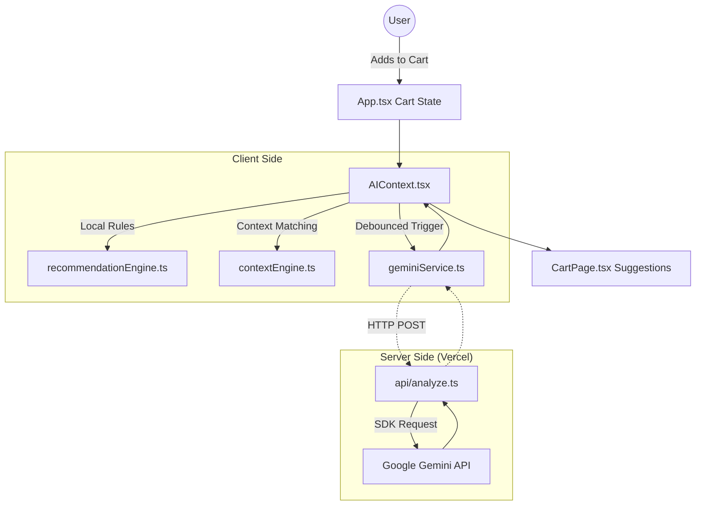

# Instamart Smart Cart Recommendations: Codebase Audit & Improvement Plan

## 1. Architecture Summary

The codebase is a serverless React application built with Vite and Tailwind CSS, simulating an Instamart-like experience. The core architecture uses a global React Context (`AIContext.tsx`) to monitor cart state changes and provide contextual product recommendations. The recommendation logic has two layers: a deterministic, rule-based local fallback (`recommendationEngine.ts` and `contextEngine.ts`) and an LLM-powered dynamic engine using the Gemini API. Data flows from user interactions (adding items) to the cart state in `App.tsx`, invoking `useEffect` hooks in the AI Context, which then fetches context and dynamically updates UI elements in the `CartPage`. 

## 2. Audit Issues Table

| # | File | Line(s) | Category | Severity | Description |
|---|------|---------|----------|----------|-------------|
| 1 | `services/geminiService.ts` | 243 | Security | **High** | The Gemini API SDK was called directly from the client using `VITE_API_KEY`, exposing the key in the browser. |
| 2 | `components/ProductListingPage.tsx` | 18-20 | Logic Error | **Medium** | Subcategories within `CATEGORIES_DB` were inherently empty, causing the page to always default the category name to "Products". |
| 3 | `components/CartPage.tsx` | 289+ | Code Quality | Low | Inline styles and complex fee calculation logic (`smallCartFee`, `toPay`) clutter the component. Recommendation: Extract pricing logic to a utility function. |
| 4 | `contextEngine.ts` | 46-73 | Performance | Low | Nested synchronous loops iterating over `cart` and all `triggers` for every context definition on each cart mutation. Recommendation: Pre-index or memoize based on cart IDs. |
| 5 | `services/geminiService.ts` | 221 | Latency | Medium | The `fetchGeminiSuggestions` function waits for the entire JSON payload from the LLM before returning, causing a 1-3s blocked perception. Recommendation: Use streaming responses. |
| 6 | `services/geminiService.ts` | 221 | Latency | Low | Redundant identical LLM queries. Recommendation: Implement a local cache mapping a hashed cart-signature string to the parsed response. |

## 3. Changes Made

During the audit, the identified High and Medium issues were remediated directly in the codebase:

- **Moved API Call to Server (Security/High)**: Refactored `services/geminiService.ts` to stop using `@google/genai` on the client. It now performs a `fetch('/api/analyze')` request, utilizing the existing secure Vercel edge function.
- **Fixed Subcategory Naming Bug (Logic/Medium)**: Patched `components/ProductListingPage.tsx` category resolution logic to pull the category name from the main category id mapping, as the sub-items array was consistently empty.

## 4. Top 3 Remaining Improvements (Next Sprint)

1. **Implement Response Streaming & Optimistic UI**: Modify `api/analyze.ts` to utilize Gemini's streaming capabilities, feeding partial JSON chunks to the client so that basic suggestions can appear faster than waiting for the entire block.
2. **Context & Recommendations Caching**: Add a caching layer inside `AIContext.tsx` or `geminiService.ts` based on a stable hash of the cart contents and the `timeBucket`. This prevents redundant LLM calls if a user toggles an item's quantity back and forth.
3. **Refactor Pricing Math into a Hook/Utility**: Clean up `CartPage.tsx` by offloading `handlingFee`, `smallCartFee`, `deliveryFee`, and total savings calculation. This reduces component density and simplifies unit testing of the cart logic.

## 5. Vercel Deployment Checklist

To ensure a smooth transition to Vercel, verify the following configuration points:

- [ ] **Environment Variables**: Add `API_KEY` to the Vercel project's settings (not as a `VITE_` variable to prevent exposure).
- [ ] **Build Configuration**: Ensure the install command is `npm install` and the build command is `npm run build` or `vite build`. The Output Directory must be set to `dist`.
- [ ] **Edge Functions Opportunities**: Update `api/analyze.ts` to use Vercel's Edge runtime by adding `export const config = { runtime: 'edge' };` at the top of the file. The `@google/genai` SDK is Edge-compatible and this will dramatically reduce initial TTFB (Time To First Byte) for AI requests.
- [ ] **CORS Configuration**: In `api/analyze.ts`, replace the placeholder `http://localhost:3000` with the actual Vercel production domain inside `allowedOrigins`, or construct dynamic CORS matching logic based on the deployed environment.
